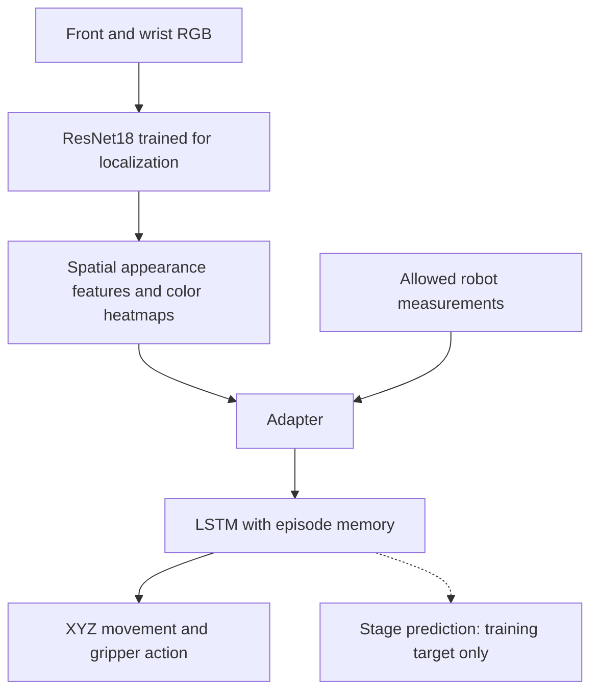

### Key learnings

- **Demonstrations provided a practical starting point.** RL from scratch struggled in the settings I tried, including curriculum learning. BC learned from scripted-teacher demonstrations that included disturbances and recovery.
- **Stage supervision helped the state-based controller.** Adding task-stage prediction increased validation completion from 7/30 to 19/30 in the LSTM comparison.
- **Localization training helped build useful visual features.** The best reported visual policy reused the localization-trained backbone and fine-tuned it during BC, completing **24/30 validation stacks (80%)**.
- **Recovery remains a limitation.** The failure videos show situations the policy cannot resolve. Collecting corrections from the visual policy's own failures is a useful next step; the existing corrections came from the state-based learner.

### Task and constraints

The aim was to train a policy to stack the green block on the red block, then the blue block on the green block. The final policy can use two RGB camera views, robot joint positions, end-effector position and orientation, and gripper positions. Additional simulator information, such as object positions and depth, can be used during training but cannot be supplied as input to the final policy. I considered using a vision-language-action model (VLA), but chose not to due to constraint on not adding additional dependencies. 

### Coding style

A large part of the code was written with Codex so I could focus more on experimental design and reviewing the robot's behavior.

### Initial plan

My initial plan was to use RL (PPO), rewarding progress as the robot picked up and placed each block. 

However, an uninitialized policy failed to learn anything. I also tried curriculum learning by taking simpler tasks (such as grasping and lifting green) but even that was difficult: a state-based PPO policy trained for 400,000 steps achieved only 2/25 successful held lifts. Giving the policy exact object information did not make learning reliable, so I moved to behavior cloning.

### Moving to Behavior Cloning (BC)

I first separated control from perception. The initial policy used previliged measurements e.g. exact block positions, and block-to-gripper offsets, without images or depth. This made iterations faster and removed visual estimation errors. It was a development baseline; the final policy still needed to work from RGB images and the permitted robot measurements.

I generated complete episodes with a scripted teacher that approaches, grasps, lifts, places, and releases each block. The teacher controls XYZ movement and opens or closes the gripper, with rotation commands fixed at zero. See a [clean demonstration](media/clean.mp4) and the [data-generation notes](README_bc_data_gen.md). The eventual dataset contained 300 successful demonstrations, including episodes with disturbances and recovery: 270 training trajectories and 30 validation trajectories. The choice for 300 samples was primarily governed by making sure we have a decent policy and I did not scale it thereafter.

<video src="media/clean.mp4" controls preload="metadata" width="512"></video>

**Non-visual Policy:**

I first tried a MLP and a transformer with a short observation history before settling on an LSTM. Its fixed-size memory carries information across the episode without requiring an ever-growing input sequence. LSTM was also the first model to get good convergence.

Predicting actions alone was not enough. I added a training task in which the LSTM also predicts the teacher's current stage: eight stages for green, eight for blue, and a final settling stage. Examples include approaching green, closing the gripper, lifting green, and releasing blue. These 17 stage labels are training targets only; neither the labels nor the predictions are fed back as action inputs.

In the comparison below, all three models were trained for 200 epochs on the same 270/30 split and learned four controls: movement along X, Y, and Z, plus gripper opening and closing.

| State-based policy | Validation stacks |
| --- | ---: |
| MLP | 6/30 |
| LSTM, action prediction only | 7/30 |
| LSTM, action and stage prediction | **19/30** |

Stage prediction improved task completion in this comparison. My intuition is that it helps the memory represent what the robot is trying to do next. Each model was trained with one random seed; the numbers show better completion, not a measured improvement in learning speed. See [how stage training works](experiment_details.md#state-policy-and-stage-training).

The video below illustrates the same stage-prediction task using the **best visual policy**. The labels come directly from its stage head. The state-policy comparison above measures the benefit of adding this supervision.

<video src="media/stage_prediction_155284722.mp4" controls preload="metadata" width="512"></video>

[Open stage-prediction video](media/stage_prediction_155284722.mp4) — successful stack in 267 actions (13.35 simulated seconds).

The [BC training guide](readme_bc_policy_train.md) describes the packaged models and training commands.

**Correction Data in BC:**

The learned policy could reach states poorly covered by its demonstrations and then struggle to recover. I used a DAgger-style correction approach: run the learner until an error is detected, then hand control to the teacher and add the successful correction to training.

I initially added 12 correction trajectories based on the non-visual policy. This has to be done carefully to not avoid regressions on pre-existing data. In the final run we combined a small number of corrections into the final dataset.

| Error | Added trajectories | Example behavior |
| --- | ---: | --- |
| Green drop | 4 | The learner opens the gripper too early and drops green. |
| Unsuccessful green grasp | 4 | The gripper repeatedly closes beside green without grasping it. |
| Unsuccessful blue grasp | 4 | The gripper repeatedly closes beside blue without grasping it. |

The teacher retreats, realigns, and tries again. See the [learner drop followed by teacher correction](media/green_drop.mp4); the [injected blue-block drop](media/drop_block.mp4) shows recovery during demonstration generation. In the latter clip, blue falls at **10.15–10.40 seconds**, and the teacher grasps it again at **13.55 seconds** before completing the stack.

| Learner error and teacher correction | Injected blue-block drop and teacher recovery |
| --- | --- |
| <video src="media/green_drop.mp4" controls preload="metadata" width="320"></video> [Open correction video](media/green_drop.mp4) | <video src="media/drop_block.mp4" controls preload="metadata" width="320"></video> [Open recovery video](media/drop_block.mp4) · Blue drops at 10.15–10.40 s; regrasp at 13.55 s. |

The part of the episode before the teacher takes over provides memory context but is excluded from action and stage supervision. Only the teacher's correction supplies targets. This brought the total to 282 training trajectories while keeping the original 30 validation trajectories unchanged.

Fine-tuning on the combined dataset gave the following full-stack results:

| Evaluation layouts | Before corrections | After fine-tuning |
| --- | ---: | ---: |
| 12 correction layouts, included in training | 1/12 | **7/12** |
| 30 validation layouts | 19/30 | **22/30** |
| 20 previously untouched test layouts | 12/20 | **13/20** |

The larger gain on correction layouts is a training-set result; the test gain was modest. See [correction training and its limits](experiment_details.md#correction-training).

**Visual policy:**

Replacing exact block information with frozen ResNet18 image features initially reduced full-stack completion:

| Policy | Validation stacks |
| --- | ---: |
| State policy after correction training | 22/30 |
| Initial visual policy | 7/30 |

This suggested that the visual representation needed work.

I added a localization pre-training step. Using simulator block centers as training targets, the model learns to estimate each block's 3D position from RGB and robot measurements. It also learns one spatial heatmap per block color in each camera view. A spatial softmax turns each heatmap into weights over image locations, helping preserve where each block appears.

| Localization approach | Mean 3D position error on validation data |
| --- | ---: |
| Direct prediction from a 4×4 feature grid | 28.70 mm |
| 16×16 grid with spatial softmax and spatial supervision | 19.90 mm |
| Also fine-tune the retained ResNet18 layer2 | **17.57 mm** |

Lower error is better. The first comparison changed resolution and supervision as well as softmax, so it does not isolate softmax's contribution.

The images below show the earlier **19.90 mm localization model**, saved at epoch 35, on two frames from validation layout 758699772. They illustrate localization before integration into the policy.

| Image element | Meaning |
| --- | --- |
| Top / bottom row | Front camera / wrist camera |
| Columns | Original RGB, then red-, green-, and blue-block heatmaps |
| Brighter cells | More probability assigned to that image region |
| Cyan circle | Predicted image location, averaged using the heatmap weights |
| Green cross | True block center projected into the image, shown for comparison only |
| Visibility percentage | The model's separate estimate that the block is visible |

**At the start of the episode:**

**With green held near the wrist camera:**

The second frame illustrates a limitation: blue's 3D position error is 57.8 mm even though the front-view heatmap looks close to its image location. Each heatmap still assigns probability when a block is hidden. The color scale is shared within each figure but differs between the two figures.

For control, I reused the image network trained for localization and its heatmap layers, then trained an adapter and a new LSTM on the demonstrations. The adapter combines the visual features and robot measurements into the LSTM's input. See [visual-model details](experiment_details.md#visual-model). The diagram shows its action path:

I compared keeping the localization-trained backbone frozen, fine-tuning it during BC, and adding predicted 3D positions and block-to-gripper offsets. All variants retain stage prediction without an extra 3D-position loss during BC. Fine-tuning the backbone currently gives the best validation result: **24/30 stacks (80%)**, using visual features rather than predicted coordinates as control inputs.

Completion length and time are averages over successful validation episodes only, at 20 actions per second.

| Rank | Visual variant | Validation success (30 layouts) | Mean completion length (actions) | Mean completion time (simulated s) |
| ---: | --- | ---: | ---: | ---: |
| 1 | Localization-trained ResNet18, fine-tuned during BC | **24/30 (80.0%)** | 318.38 | 15.92 |
| 2 | Localization-trained ResNet18, frozen during BC | 20/30 (66.7%) | 319.40 | 15.97 |
| 3 | Frozen localization-trained ResNet18 + predicted positions and offsets | 17/30 (56.7%) | 300.24 | 15.01 |
| 4 | Spatial model with original frozen ResNet18 | 8/30 (26.7%) | 355.00 | 17.75 |

I also tried fine-tuning the RGB BC policy with RL, using an intermediate reward of **+1 for placing green on red** and a final reward of **+10 for completing the stack**. This did not improve task completion over the BC policy in the runs evaluated.

**Validation** uses the 30 held-out layouts from the demonstration split to select checkpoints. These layouts are excluded from training.

See [how the comparisons should be read](experiment_details.md#reading-the-results).

The videos below compare the same two validation layouts using each variant's best checkpoint from the table above, with no teacher takeover. Layout **155284722** succeeds only in the top-ranked model; **873629338** fails in all four. These examples were selected to illustrate those outcomes.

Inline playback depends on the Markdown viewer; use the links if video elements are not supported.

| Visual variant (ranked as above) | Validation layout 155284722 | Validation layout 873629338 |
| --- | --- | --- |
| 1. Localization-trained ResNet18, fine-tuned during BC | <video src="media/validation_finetuned_155284722.mp4" controls preload="metadata" width="320"></video> [Open video](media/validation_finetuned_155284722.mp4) · **Pass: 267 actions, 13.35 s** | <video src="media/validation_finetuned_873629338.mp4" controls preload="metadata" width="320"></video> [Open video](media/validation_finetuned_873629338.mp4) · Fail: 900-action limit |
| 2. Localization-trained ResNet18, frozen during BC | <video src="media/validation_frozen_155284722.mp4" controls preload="metadata" width="320"></video> [Open video](media/validation_frozen_155284722.mp4) · Fail: 900-action limit | <video src="media/validation_frozen_873629338.mp4" controls preload="metadata" width="320"></video> [Open video](media/validation_frozen_873629338.mp4) · Fail: 900-action limit |
| 3. Frozen localization-trained ResNet18 + predicted positions and offsets | <video src="media/validation_geometry_155284722.mp4" controls preload="metadata" width="320"></video> [Open video](media/validation_geometry_155284722.mp4) · Fail: 900-action limit | <video src="media/validation_geometry_873629338.mp4" controls preload="metadata" width="320"></video> [Open video](media/validation_geometry_873629338.mp4) · Fail: 900-action limit |
| 4. Spatial model with original frozen ResNet18 | <video src="media/validation_original_155284722.mp4" controls preload="metadata" width="320"></video> [Open video](media/validation_original_155284722.mp4) · Fail: 900-action limit | <video src="media/validation_original_873629338.mp4" controls preload="metadata" width="320"></video> [Open video](media/validation_original_873629338.mp4) · Fail: 900-action limit |

Times are simulated seconds. A failed episode reaches 45 seconds without completing the stack.

### Evaluation harness

The packaged evaluation runner is [evaluate.py](evaluate.py). Its `evaluate_one` function uses the bundled [simulator](motion_planning/simulator.py) directly, counts consecutive successful steps, and records success, action count, completion time, and optional video. Run it from inside the delivered folder using the [setup and evaluation instructions](README.md).

The [trained BC checkpoint](checkpoints/best_visual_bc.pt) is included in the bundle and corresponds to the top-ranked visual model above.

I evaluate the policy by running complete episodes from a fixed set of randomly generated layouts, resetting its memory at the start of each episode. The BC comparisons report results on 30 validation layouts. I also check the 12 correction-training layouts separately to see whether the policy has learned to handle those known failure cases.

For these BC results, success requires the simulator's official full-stack check to stay true for **10 consecutive actions**. Episodes stop at success or **900 policy actions**. At 20 actions per second, this is a 45-second limit. One initial zero-action step obtains the first observation and is excluded from policy time; success-confirmation actions are included.

Failures count against the success rate and are excluded from the average completion time. Simulator state is available to the evaluator for scoring and diagnostics, but the visual policy receives only the six permitted observation fields. See [evaluation sets and timing](experiment_details.md#evaluation-sets-and-timing).

## Six examples from the best BC checkpoint

These three successes and three failures use the delivered checkpoint on validation layouts, with no teacher takeover or injected disturbances. The failures include misplaced blocks and attempts to continue from an incorrect stack configuration. These are selected examples of recovery difficulties; the overall validation result remains 24/30.

| Successful rollouts | Failed rollouts |
| --- | --- |
| <video src="media/validation_finetuned_155284722.mp4" controls preload="metadata" width="400"></video> [Layout 155284722](media/validation_finetuned_155284722.mp4) — **267 actions, 13.35 s**. Completes green-on-red, then blue-on-green. | <video src="media/validation_finetuned_873629338.mp4" controls preload="metadata" width="400"></video> [Layout 873629338](media/validation_finetuned_873629338.mp4) — **900 actions, no completion**. Stalls near red without grasping green or blue. |
| <video src="media/validation_finetuned_225192514.mp4" controls preload="metadata" width="400"></video> [Layout 225192514](media/validation_finetuned_225192514.mp4) — **258 actions, 12.90 s**. Completes the full stack from another starting layout. | <video src="media/validation_finetuned_731014221.mp4" controls preload="metadata" width="400"></video> [Layout 731014221](media/validation_finetuned_731014221.mp4) — **900 actions, no completion**. Places blue on green while green remains beside red. |
| <video src="media/validation_finetuned_1628365314.mp4" controls preload="metadata" width="400"></video> [Layout 1628365314](media/validation_finetuned_1628365314.mp4) — **551 actions, 27.55 s**. Completes both placements in a longer rollout. | <video src="media/validation_finetuned_1311387844.mp4" controls preload="metadata" width="400"></video> [Layout 1311387844](media/validation_finetuned_1311387844.mp4) — **900 actions, no completion**. Misplaces green, attempts blue, then returns to green without completing the stack. |

All times are simulated seconds. Each failure reaches the 45-second limit. The [example manifest](plans/report_examples.json) records the seeds, outcomes, and checkpoint and video hashes; see the [evaluation command](readme_bc_policy_train.md#evaluate-a-checkpoint) to reproduce them.

## What I could have done differently and remaining limitations

- Working in a new domain taught me that learning to perceive objects and learning to control the robot are separate problems. I could have started with a pre-trained VLA or explored a high-level planner with simpler pick-and-place policies. I chose a simpler approach given the available exploration budget.

- I underestimated the difficulty of learning this multi-step task with RL from scratch. The early state-based experiments also struggled, so weak visual perception alone does not explain the result. Starting with demonstrations earlier would have given me more time to improve the policy and study its failures.

- I could have explored larger and more varied demonstration datasets, but stopped expanding the data once I had a working policy. The failure examples above show that recovery remains a limitation. The existing corrections came from the state-based learner; collecting corrections from the visual policy's own failures would be a useful next step.

- Stage supervision improved completion in the state-policy comparison, but its effect on recovery needs further testing. One possibility is that it encourages the model to follow the demonstrated sequence too rigidly when recovery requires a different action. The current results do not establish that stage supervision causes this behavior.