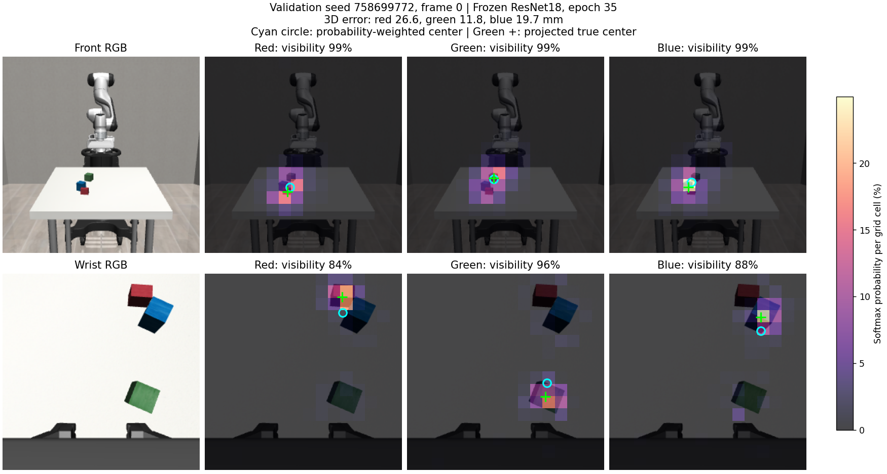
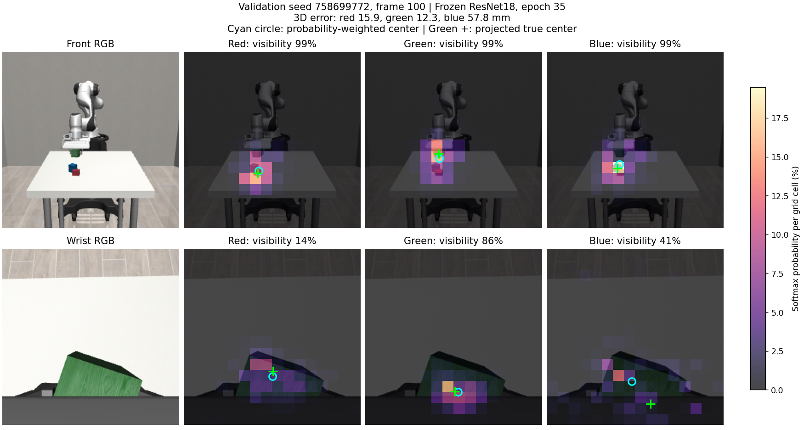
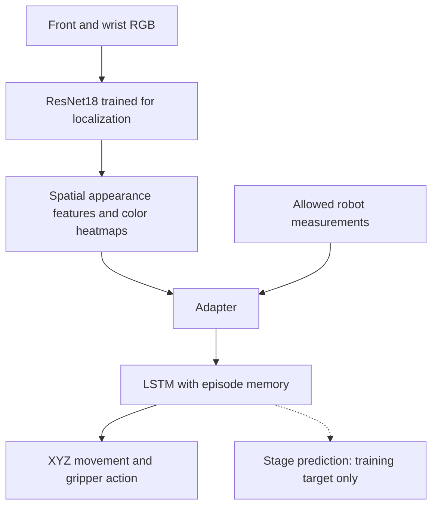

### TLDR
<to be updated>
- RL on uninitialized policy did not work well even with curriculum learning

### Task and constraints

The aim was to train a policy to stack the green block on the red block, then the blue block on the green block. The final policy can use two RGB camera views, robot joint positions, end-effector position and orientation, and gripper positions. Additional simulator information, such as object positions and depth, can be used during training but cannot be supplied as input to the final policy. I considered using a vision-language-action model (VLA), but chose not to due to constraint on not adding additional dependencies. 

### Coding style

A large part of the code was written with Codex so I could focus more on experimental design and reviewing the robot's behavior.

### Initial plan

My initial plan was to use RL (PPO), rewarding progress as the robot picked up and placed each block. 

However, an uninitialized policy failed to learn anything. I also tried curriculum learning by taking simpler tasks (such as grasping and lifting green) but even that was difficult: a state-based PPO policy trained for 400,000 steps achieved only 2/25 successful held lifts. Giving the policy exact object information did not make learning reliable, so I moved to behavior cloning (BC).

### Moving to Behavior Cloning (BC)

I first separated control from perception. The initial policy used previliged measurements e.g. exact block positions, and block-to-gripper offsets, without images or depth. This made iterations faster and removed visual estimation errors. It was a development baseline; the final policy still needed to work from RGB images and the permitted robot measurements.

I generated complete episodes with a scripted teacher that approaches, grasps, lifts, places, and releases each block. The teacher controls XYZ movement and opens or closes the gripper, with rotation commands fixed at zero. See a [clean demonstration](media/clean.mp4) and the [data-generation notes](README_bc_data_gen.md). The eventual dataset contained 300 successful demonstrations, including episodes with disturbances and recovery: 270 training trajectories and 30 validation trajectories.

<video src="media/clean.mp4" controls preload="metadata" width="512"></video>

**Policy:**

The [BC training guide](readme_bc_policy_train.md) describes the packaged models and training commands.

I tried a multilayer perceptron (MLP) and a transformer with a short observation history before settling on a 128-unit long short-term memory network (LSTM). Its fixed-size memory carries information across the episode without requiring an ever-growing input sequence.

Predicting actions alone was not enough. I added a training task in which the LSTM also predicts the teacher's current stage: eight stages for green, eight for blue, and a final settling stage. Examples include approaching green, closing the gripper, lifting green, and releasing blue. These 17 stage labels are training targets only; neither the labels nor the predictions are fed back as action inputs.

In the comparison below, all three models were trained for 200 epochs on the same 270/30 split and learned four controls: movement along X, Y, and Z, plus gripper opening and closing.

| State-based policy | Validation stacks | New-layout stacks |
| --- | ---: | ---: |
| MLP | 6/30 | 2/20 |
| LSTM, action prediction only | 7/30 | 9/20 |
| LSTM, action and stage prediction | **19/30** | **12/20** |

Stage prediction improved task completion in this comparison. My intuition is that it helps the memory represent what the robot is trying to do next. It did not solve every transition: in four of the eight failed episodes on new layouts, the robot placed green at some point but never registered a blue grasp. Each model was trained with one random seed; the numbers show better completion, not a measured improvement in learning speed. See [how stage training works](experiment_details.md#state-policy-and-stage-training).

**Corrections:**

The learned policy could reach states poorly covered by its demonstrations and then struggle to recover. I used a DAgger-style correction approach: run the learner until an error is detected, then hand control to the teacher and add the successful correction to training.

I added 12 correction trajectories:

| Error | Added trajectories | Example behavior |
| --- | ---: | --- |
| Green drop | 4 | The learner opens the gripper too early and drops green. |
| Unsuccessful green grasp | 4 | The gripper repeatedly closes beside green without grasping it. |
| Unsuccessful blue grasp | 4 | The gripper repeatedly closes beside blue without grasping it. |

The teacher retreats, realigns, and tries again. See the [learner drop followed by teacher correction](media/green_drop.mp4); the [injected-drop example](media/drop_block.mp4) shows recovery during demonstration generation.

| Learner error and teacher correction | Injected drop and teacher recovery |
| --- | --- |
| <video src="media/green_drop.mp4" controls preload="metadata" width="320"></video> [Open correction video](media/green_drop.mp4) | <video src="media/drop_block.mp4" controls preload="metadata" width="320"></video> [Open recovery video](media/drop_block.mp4) |

The part of the episode before the teacher takes over provides memory context but is excluded from action and stage supervision. Only the teacher's correction supplies targets. This brought the total to 282 training trajectories while keeping the original 30 validation trajectories unchanged.

Fine-tuning on the combined dataset gave the following full-stack results:

| Evaluation layouts | Before corrections | After fine-tuning |
| --- | ---: | ---: |
| 12 correction layouts, included in training | 1/12 | **7/12** |
| 30 validation layouts | 19/30 | **22/30** |
| 20 previously untouched test layouts | 12/20 | **13/20** |

The larger gain on correction layouts is a training-set result; the test gain was modest. See [correction training and its limits](experiment_details.md#correction-training).

These corrections were collected with the state-based learner and also used to train the visual models. Collecting new corrections from the visual policy's own errors remains future work.

**Visual policy:**

Replacing exact block information with frozen ResNet18 image features initially reduced full-stack completion:

| Policy | Validation stacks | Development stacks |
| --- | ---: | ---: |
| State policy after correction training | 22/30 | 13/20 |
| Initial visual policy | 7/30 | 3/20 |

This suggested that the visual representation needed work.

I added a localization pre-training step. Using simulator block centers as training targets, the model learns to estimate each block's 3D position from RGB and robot measurements. It also learns one spatial heatmap per block color in each camera view. A spatial softmax turns each heatmap into weights over image locations, helping preserve where each block appears.

| Localization approach | Mean 3D position error on validation data |
| --- | ---: |
| Direct prediction from a 4×4 feature grid | 28.70 mm |
| 16×16 grid with spatial softmax and spatial supervision | 19.90 mm |
| Also fine-tune the retained ResNet18 layer2 | **17.57 mm** |

Lower error is better. The first comparison changed resolution and supervision as well as softmax, so it does not isolate softmax's contribution.

The images below show the earlier **19.90 mm localization model**, saved at epoch 35, on two frames from validation layout 758699772. They illustrate localization before integration into the policy.

| Image element | Meaning |
| --- | --- |
| Top / bottom row | Front camera / wrist camera |
| Columns | Original RGB, then red-, green-, and blue-block heatmaps |
| Brighter cells | More probability assigned to that image region |
| Cyan circle | Predicted image location, averaged using the heatmap weights |
| Green cross | True block center projected into the image, shown for comparison only |
| Visibility percentage | The model's separate estimate that the block is visible |

**At the start of the episode:**

**With green held near the wrist camera:**

The second frame illustrates a limitation: blue's 3D position error is 57.8 mm even though the front-view heatmap looks close to its image location. Each heatmap still assigns probability when a block is hidden. The color scale is shared within each figure but differs between the two figures.

For control, I reused the image network trained for localization and its heatmap layers, then trained an adapter and a new LSTM on the demonstrations. The image network, or backbone, stays frozen during BC in the strongest measured variant: its weights are not updated. The adapter combines the visual features and robot measurements into the LSTM's input. See [visual-model details](experiment_details.md#visual-model). The diagram shows its action path:

Predicted 3D coordinates are **not inputs to this policy**. Localization teaches useful features before BC; the controller then learns from those features. The stage prediction task remains, but no extra 3D-position loss is used during BC in this variant.

At the same 50-epoch BC budget:

| Visual variant | Validation stacks | Development stacks |
| --- | ---: | ---: |
| Spatial model with original frozen ResNet18 | 8/30 | 6/20 |
| Localization-trained ResNet18, frozen during BC | **20/30** | **16/20** |
| Also fine-tune the backbone during BC | 16/30 | 16/20 |
| Also supply predicted positions and offsets | 13/30 | 8/20 |

The checkpoint selected within the 50-epoch frozen-backbone run achieved the best measured validation result. Longer training did not consistently help:

| Training budget | Validation stacks |
| --- | ---: |
| 50 epochs | **20/30** |
| 100 epochs | 16/30 |
| 150 epochs | 18/30 |

These are development results as of September 14; further runs are ongoing, and the visual policy has not yet been evaluated on an untouched final test. See [how the comparisons should be read](experiment_details.md#reading-the-results).

These three clips come from the same saved model selected during that 50-epoch run, with no teacher takeover:

Inline playback depends on the Markdown viewer; use the links if video elements are not supported.

| Rollout video | Outcome | Policy actions | Completion time |
| --- | --- | ---: | ---: |
| <video src="media/visual_success_23000000.mp4" controls preload="metadata" width="320"></video> [Layout 23000000](media/visual_success_23000000.mp4) | Successful stack | 304 | 15.20 simulated seconds |
| <video src="media/visual_success_23000007.mp4" controls preload="metadata" width="320"></video> [Layout 23000007](media/visual_success_23000007.mp4) | Successful stack | 288 | 14.40 simulated seconds |
| <video src="media/visual_failure_23000002.mp4" controls preload="metadata" width="320"></video> [Layout 23000002](media/visual_failure_23000002.mp4) | No stable full stack | 900 (limit) | Did not complete |

**Evaluation harness:**

I evaluate the policy by running complete episodes from a fixed set of randomly generated layouts, resetting its memory at the start of each episode. The BC comparisons use 30 validation layouts and 20 development layouts. Results on the 12 correction-training layouts are reported separately to check whether the policy has learned to handle those known failure cases.

For these BC results, success requires the simulator's official full-stack check to stay true for **10 consecutive actions**. Episodes stop at success or **900 policy actions**. At 20 actions per second, this is a 45-second limit. One initial zero-action step obtains the first observation and is excluded from policy time; success-confirmation actions are included.

For the visual checkpoint shown above:

| Evaluation set | Full-stack success | Mean completion time among successes |
| --- | ---: | ---: |
| Validation | 20/30 (66.7%) | 15.97 simulated seconds |
| Development | 16/20 (80.0%) | 16.42 simulated seconds |

Failures count against the success rate and are excluded from the average completion time. Simulator state is available to the evaluator for scoring and diagnostics, but the visual policy receives only the six permitted observation fields. See [evaluation sets and timing](experiment_details.md#evaluation-sets-and-timing).

## What I could have done differently

Working in a new domain taught me that learning to perceive objects and learning to control the robot are separate problems. I could have started with a pre-trained VLA or explored a high-level planner with simpler pick-and-place policies. Either approach would still need testing on this task.

I was too optimistic about learning the full behavior with RL from scratch. Starting earlier with demonstrations, checking actual rollouts rather than only action loss, and collecting corrections from the visual learner would have made the process more focused. The next step is to address those visual-policy failures and then freeze a checkpoint for a separate final test.
